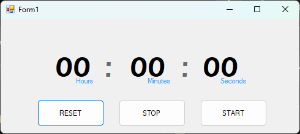

# 🕒 Simple Chronometer (with C#) 🇺🇸 
This is a basic chronometer (stopwatch) application built as a school project using C# Windows Form Application.
It's great example for beginners who want to understand how to use the **Timer** Control in C#, particularly how the **Interval** property work and how to handle **Tick Timer** Event. 

## 🖼️ Screenshot

## 🤔 How to run

 1. Clone the repo
 2.  Open the ``.sln`` file in Visual Studio
 3. Press ``F5`` or click Start button to run the app. Enjoy.

# 🕒کرنومتر ساده (نوشته شده با سی‌شارپ) 🇮🇷
 این پروژه یک کرومتر ساده است که به عنوان یک پروژه مدرسه ([کتاب توسعه‌ برنامه‌سازی و پایگاه‌داده](http://chap.sch.ir/books/13352) - رشته‌ شبکه و نرم‌افزار رایانه - پودمان سوم) نوشته شده است.
 این پروژه می‌تواند یک مثال خوب برای تازه‌کاران و هنرجویان رشته شبکه و نرم‌افزار باشد. افرادی که می‌خواهد بفهمند که چگونه از کنترل **تایمر** در سی‌شارپ استفاده کنند؛ به‌ویژه درک چگونگی کارکرد مهم‌ترین ویژگی تایمر، یعنی **Interval** و همچنین رویداد مهم تایمر **Tick**.
 
 ## 🤔 چطور اجرا می‌شود
 1. ریپازیتوری را کلون کنید (دانلود کنید)
 2.  فایل ``.sln`` در ویژوال استودیو باز کنید
 3. دکمه ``F5`` را فشار دهید یا روی دکمه استارت کلیک کنید تا برنامه اجرا شود.
